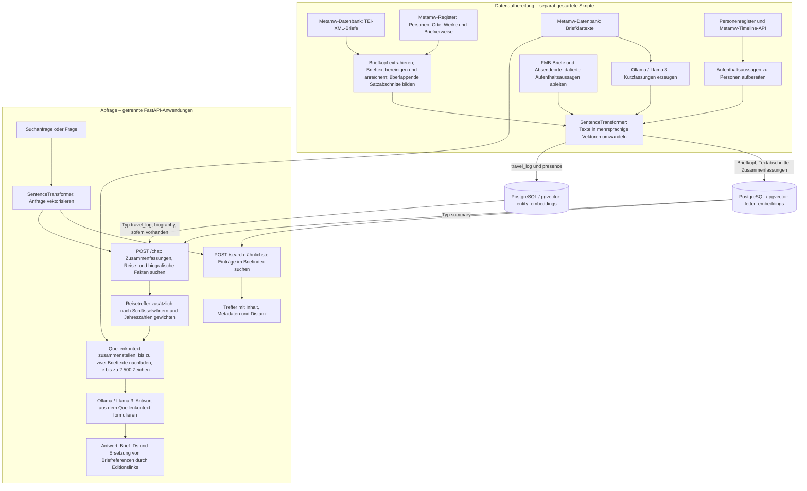

# Workflow und Berichtstext: letter-ai-bridge

Stand: 11. September 2026. Grundlage: statische Prüfung des Bridge-Codes bei
Commit `fc4e2d9` und Abgleich mit `AUDIT.md` vom 7. September 2026.
Das Diagramm zeigt implementierte Verarbeitungspfade; es bestätigt keinen
erfolgreichen Betrieb gegen die tatsächliche Datenbank oder KI-Laufzeit.

## Workflow

Die Aufbereitungspfade sind eigenständige Skripte; ein gemeinsamer Scheduler ist
hier nicht implementiert. Der gemeinsame Embedding-Knoten steht für dasselbe
Modell (`paraphrase-multilingual-MiniLM-L12-v2`) in mehreren Komponenten.
Die Datenbank mit den Quell- und Embedding-Tabellen gehört zum gemeinsam genutzten
Metamw-Kontext.

- **Briefindex:** `process_letters.py` wählt Briefe ohne jeglichen Eintrag in
  `letter_embeddings`. `LetterIngester` erzeugt einen Briefkopf-Chunk sowie
  Text-Chunks aus absatzweisen Fenstern von bis zu drei Sätzen bei Schrittweite
  zwei. Registerinformationen fließen über TEI-Handler in Text und Metadaten ein.
  Ein konfigurierbarer Reset kann vorab den gesamten Briefindex löschen.
- **Zusammenfassungen:** `generate_letter_summaries.py` verarbeitet
  `letters.default_text_content`, lässt kurze Zusammenfassungen erzeugen und
  speichert Text und Vektor per Upsert als `summary`.
- **Aufenthaltsdaten:** `process_fmb_locations.py` leitet aus FMB-Briefnamen und
  Absendeorten Aussagen des Typs `travel_log` ab. `sync_whereabouts.py` liest
  Personen-Timelines aus der Backend-API und speichert sie als `presence`.
- **Suche und Chat:** `/search` sucht ohne Typfilter in `letter_embeddings`.
  `/chat` nutzt dort ausschließlich `summary` und in `entity_embeddings` die
  Typen `travel_log` und `biography`. `presence` wird aktuell nicht abgefragt.
  Ein Importpfad für `biography` ist im untersuchten Repository nicht vorhanden.
  Der Chat ruft die Such-API nicht auf, sondern greift selbst auf die DB-Modelle zu.

## Kurzbeschreibung für den Rechenschaftsbericht

Mit „letter-ai-bridge“ wurde eine KI-gestützte Erschließungskomponente für den
digitalen Briefbestand entwickelt. Sie bereitet TEI-XML-Briefe aus der
Metamw-Datenbank auf, erschließt Briefmetadaten und Registerbezüge und überführt
Textabschnitte in mehrsprachige Vektorrepräsentationen. Ergänzende Verarbeitungspfade
erzeugen Briefzusammenfassungen und bereiten Aufenthaltsinformationen auf.
Auf dieser Grundlage wurden Schnittstellen für semantische Suche und
quellengestützte Fragen an den Bestand implementiert. Die Antwortgenerierung
verbindet recherchierte Inhalte mit einem über Ollama angebundenen Sprachmodell
und ergänzt Verweise auf die digitale Briefedition. Der vorliegende Stand bildet
eine technische Grundlage; die durchgängige Betriebsfähigkeit und die fachliche
Qualität der Ergebnisse sind gesondert zu validieren.

## Implementierte Funktionen

- Auslesen und stapelweise Verarbeiten von Briefen aus PostgreSQL.
- Extraktion von Briefkopf-Metadaten und Aufteilung des Brieftexts in überlappende Satzabschnitte.
- Textbereinigung und Anreicherung über Personen-, Orts-, Werk- und Briefregister.
- Erzeugung und Speicherung mehrsprachiger Text-Embeddings mit pgvector.
- KI-generierte Kurzfassungen mit Speicherung und Aktualisierung im Briefindex.
- Aufbereitung von Aufenthaltsdaten aus Briefbezügen und der Personen-Timeline-API.
- Semantische Suche über eine eigene HTTP-Schnittstelle.
- Kontextgestützte Chat-Antworten mit Briefquellen und Editionslinks.

„Implementiert“ bezeichnet vorhandenen Code, keine abgeschlossene fachliche oder
betriebliche Abnahme.

## Einordnung der AUDIT.md und Prüfgrenzen

Die ursprünglichen Audit-Tickets sind historische Befunde. Der heutige Code
enthält unter anderem einen konfigurierbaren statt unbedingten Reset, eine
Auswahl ohne das frühere 100-Briefe-Limit, überlappende Satzfenster, weitergereichte
Entitätsmetadaten und einen registrierten Titel-Handler. Core-Konfiguration und
Chat verwenden inzwischen die TOML-Konfiguration; die Such-API liest weiterhin
den YAML-Abschnitt `development`. Diese statischen Unterschiede rechtfertigen
ohne erneute Regressionstests keine pauschale Erledigung der alten Tickets.

Für die Interpretation des Diagramms relevant:

- Die Auswahl „ohne Embeddings“ berücksichtigt alle Eintragstypen. Bereits
  vorhandene Zusammenfassungen können daher die Aufnahme der Brieftext-Chunks
  verhindern; geänderte oder nur teilweise indexierte Briefe werden nicht
  automatisch vervollständigt.
- Der optionale Reset verwendet weiterhin `TRUNCATE ... RESTART IDENTITY CASCADE`.
  Uploadfehler werden im Upload-Service weiterhin abgefangen und nicht an den
  Fehlerzähler des Imports weitergegeben.
- Such- und Chat-API erzwingen CUDA und verwenden beim direkten Start beide
  Port 8000. Die Startfähigkeit wurde nicht geprüft.
- Reiseaussagen sind aus Quellenfeldern abgeleitet. Quellenlinks und ein
  quellenorientierter Prompt garantieren keine historisch korrekten Antworten;
  eine automatische Prüfung der Aussagen gegen die Quellen ist nicht implementiert.
- Schema, benötigte Indizes, vorhandene Wissensdaten und tatsächliche
  Laufzeitkonfiguration wurden nicht live überprüft. Der Teststand „6 fehlgeschlagen,
  1 bestanden“ stammt aus dem Audit vom 7. September und wurde nicht neu erhoben.

Geprüft wurden Quellcode, Aufrufpfade und das Audit. Ergänzend wurde im
Backend-Referenzzweig `master` lesend nachvollzogen, dass das Letter-Modell
`default_text_content` als Textrepräsentation verwendet und über `as_text` befüllt.
Es wurden keine Anwendungen, Importskripte, Modell-Downloads oder Tests gestartet
und keine Verbindungen zu Datenbank, Backend-API oder Ollama hergestellt.

## Zentrale Codebelege

| Verarbeitung | Dateien |
| --- | --- |
| Briefimport und Auswahl | [process_letters.py](scripts/process_letters.py), [letter.py](app/database/models/letter.py) |
| Briefkopf, Text und Vektoren | [letter_ingester.py](app/core/letter_ingester.py), [tei_header_chunker.py](app/indexer/tei_header_chunker.py), [tei_chunker.py](app/indexer/tei_chunker.py) |
| Registeranreicherung | [tei_cleaner.py](app/indexer/tei_cleaner.py), [retrieve_infos_service.py](app/database/services/entity_resolution/retrieve_infos_service.py) |
| Zusammenfassungen | [generate_letter_summaries.py](scripts/generate_letter_summaries.py), [summary_service.py](app/api/services/summary_service.py) |
| Aufenthaltsdaten | [protag_whereabouts_service.py](app/core/services/protag_whereabouts_service.py), [sync_whereabouts.py](scripts/sync_whereabouts.py) |
| Speicherung und Retrieval | [ingest_chunks_service.py](app/database/services/ingest_chunks_service.py), [letter_embedding.py](app/database/models/letter_embedding.py), [entity_embedding.py](app/database/models/entity_embedding.py) |
| Suche und Chat | [search_service.py](app/api/search_service.py), [chat_service.py](app/api/chat_service.py), [information_retriever.py](app/api/logic/information_retriever.py) |

Dokumentationsauftrag: **LAB-016** in [AUDIT.md](AUDIT.md).
